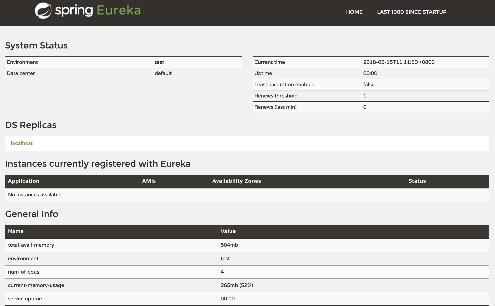
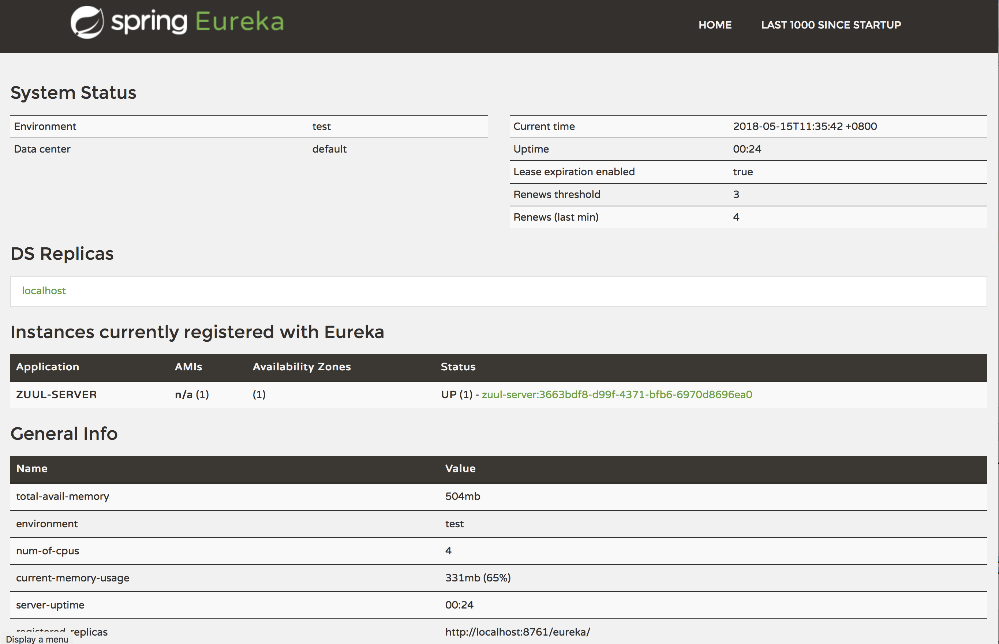

# Spring Cloud MicroService Demo 说明


这个 Demo 使用最基础的组件演示一个 `Spring Cloud`  框架治理下的微服务架构，通过本 Demo 对 `Spring Cloud` 有一个最直观的感受。


**目录**

[TOC]

## Spring Boot 部分基础

在具体分解各项目前，有以下事项需要先了解:

**Spring boot 配置优先级**

1. 命令行参数
2. 通过 `System.getProperties()` 获取的 Java 系统参数
3. 操作系统环境变量
4. 从 `java:comp/env` 得到的` JNDI` 属性
5. 通过 `RandomValuePropertySource` 生成的`random.*`属性
6. 应用 Jar 文件之外的属性文件(通过`spring.config.location`参数)
7. 应用 Jar 文件内部的属性文件
8. 在应用配置 Java 类（包含`@Configuration`注解的 Java 类）中通过`@PropertySource`注解声明的属性文件。
9. 通过`SpringApplication.setDefaultProperties`声明的默认属性。

Spring Boot 的这个配置优先级看似复杂，其实是很合理的。比如命令行参数的优先级被设置为最高。
这样的好处是可以在测试或生产环境中快速地修改配置参数值，而不需要重新打包和部署应用。


**Spring boot 配置文件加载优先级**

1. `bootstrap.[yaml|yml|properties]`
2. `application.[yaml|yml|properties]`


**Srping boot 配置加载特点**

Spring Boot在优先级更高的位置找到了配置，那么它就会无视优先级低的配置


## 使用到的组件

* Eureka: 发现和注册服务
* Zuul: 网关服务
* Feign: 服务客户端(服务之间调用)
* Spring Boot: Spring Cloud 微服务的核心
* Docker 和 docker compose:  方便集成测试
* Gradle: 构建工具


具体代码在 [gitlab](http://git.pinganzhiyuan.com:7000/java/demo/docker-spring-cloud) 中都能找到，这里不具体列举代码以做说明。


* `Spring Cloud` 的所有组件都没有中心节点，每个组件均可多重部署以实现高可用。
* 各服务组件的启动顺序没有强制要求


### Eureka 发现和注册服务

Eureka，服务注册和发现，它提供了一个服务注册中心、服务发现的客户端，还有一个方便的查看所有注册的服务的界面。

所有的服务使用Eureka的服务发现客户端来将自己注册到Eureka的服务器上。

然后各个服务之间就可以通过 `serviceId` 进行引用，不需关心具体的服务所在的实例。

**依赖**

* `compile 'org.springframework.cloud:spring-cloud-starter-eureka-server'`

**代码**

在 `Spring Boot` 程序主类添加注解 `@EnableEurekaServer` 就完成发现和注册服务的编写

**配置**

配置文件中，专用的 `Eureka` 服务，不作为一个客户端注册到注册中心，因此需要配置 `eureka.client.registerWithEureka=false`

**运行**

`gradle bootRun` 或 `gradle bootRepackage` 之后 `java -jar eureka-server.jar`

默认监听端口 `8761`，可通过浏览器访问 `http://127.0.0.1:8761` 来查看服务注册状态




#### 进阶内容

Eureka把所有注册信息都放在内存中，所有注册过的客户端都会向Eureka发送心跳包来保持连接。客户端会有一份本地注册信息的缓存，这样就不需要每次远程调用时都向Eureka查询注册信息。

默认情况下，Eureka服务端自身也是个客户端，所以需要指定一个Eureka Server的URL作为"伙伴"(peer)。如果你没有提供这个地址，Eureka Server也能正常启动工作，但是在日志中会有大量关于找不到peer的错误信息。

**Standalone模式**

只要Eureka Server进程不会挂掉，这种集Server和Client于一身和心跳包的模式能让Standalone(单台)部署的Eureka Server非常容易进行灾难恢复。在 Standalone 模式中，可以通过下面的配置来关闭查找“伙伴”的行为：


```yaml
erver:
  port: 8761

eureka:
  instance:
    hostname: localhost
  client:
    registerWithEureka: false
    fetchRegistry: false
​````

**"伙伴"感知**

Eureka Server可以通过运行多个实例并相互指定为“伙伴”的方式来达到更高的高可用性。实际上这就是默认设置，你只需要指定“伙伴”的地址就可以了:

​```yaml
---
spring:
  profiles: peer1
eureka:
  instance:
    hostname: peer1
  client:
    serviceUrl:
      defaultZone: http://peer2/eureka/

---
spring:
  profiles: peer2
eureka:
  instance:
    hostname: peer2
  client:
    serviceUrl:
      defaultZone: http://peer1/eureka/
```


在上面这个例子中，我们通过使用不同profile配置的方式可以在本地运行两个Eureka Server。你可以通过修改/etc/host文件，使用上述配置在本地测试伙伴感特性。

你可以同时启动多个Eureka Server, 并通过伙伴配置使之围成一圈(相邻两个Server互为伙伴)，这些Server中的注册信息都是同步的。


### Zuul 网关服务

Zuul，网关，所有的客户端请求通过这个网关访问后台的服务，可以使用一定的路由配置来判断某一个URL由哪个服务来处理，并从Eureka获取注册的服务来转发请求。

同时在 Zuul 网关中可以统一实现身份验证、数据安全检查、参数过滤、日志记录的操作。

Zuul 由Netflix公司开源，Netflix使用Zuul做如下事情

* 认证鉴权
* 审查
* 压力测试
* 金丝雀测试
* 动态路由
* 服务迁移
* 负载剪裁
* 安全
* 静态应答处理

Zuul允许使用任何支持JVM的语言来建立规则和过滤器，内置了对Java和Groovy的支持。


**依赖**

* `compile 'org.springframework.cloud:spring-cloud-starter-eureka'`
* `compile 'org.springframework.cloud:spring-cloud-starter-zuul'`

**代码**

在 `Spring Boot` 程序主类添加注解 `@EnableEurekaClient` 和
`@EnableZuulProxy` 就完成基础网关服务编写

**配置**

`application.yml`

```yaml
---
spring:
  application:
    name: zuul-server # 应用名，在 eureka 注册后，成为 eureka 的 serviceId

server:
  port: ${SERVER_PORT:8080} # 网关监听的端口，可部署多个 zuul，分别监听不同的端口,然后在其前端再部署 LBS 做负载均衡，以实现高可用。


management:
  security:
    enabled: true

security:
  basic:
    enabled: false
```

`bootstrap.yml`

```yaml
# 向 eureka 注册自己
eureka:
  instance:
    preferIpAddress: true
    instanceId: ${spring.application.name}:${spring.application.instance_id:${random.uuid}}
  client:
    serviceUrl:
      defaultZone: ${EUREKA_URI:http://localhost:8761/eureka}


hystrix:
  command:
    default:
      execution:
        timeout:
          enabled: false


# 默认忽略所有自动发现的服务，明确配置路由，防止不安全的事件发生
# 可将路由配置转移到数据库中储存、由 zuul 从数据库中加载
zuul:
  ignoredServices: '*'
  debug:
    parameter: true
    request: true
  routes:
    greeting-service:
      path: /greeting/**
      serviceId: greeting-service
    consumer-service:
      path: /consumer/**
      serviceId: consumer-service
```


**运行**

`gradle bootRun` 或 `gradle bootRepackage` 之后 `java -jar zuul-server.jar`

默认监听端口 `8080`，可通过浏览器访问 `http://127.0.0.1:8080` ，由于还没有启动其后段的服务 `greeting-service` 和 `consumer-service` 这时访问应该是什么都看不到的。

刷新 `http://127.0.0.1:8761` 页面，可以看到 `zuul-server` 已经注册到发现服务中。




#### 进阶内容

可以使用正则匹配来建立ServiceId和路由之间的默契。使用正则表达式命名组来从服务ID中提取变量，注入他们到一个路由模式里。

```java
ApplicationConfiguration.java
@Bean
public PatternServiceRouteMapper serviceRouteMapper() {
    return new PatternServiceRouteMapper(
        "(?<name>^.+)-(?<version>v.+$)",
        "${version}/${name}");
}
```

一个服务ID为`myusers-v1`将被映射到路由 `/v1/myusers/**` 上。任何正则表达式都会被接受，但是所有的名称组必须同时出现在servicePattern和routePattern上。如果servicePattern不匹配Service Id，将使用默认行为。

在上面的例子中， 服务ID是 `myusers` 的服务会被映射到路由： `/myusers/**`（不检测版本）。 


### greeting-service 的实现

`greeting-service` 是一个简单的 `Spring Boot` web 应用，只要在主类中添加 `@EnableEurekaClient` 和添加一段配置文件,就可以将一个 `Spring Boot` web 应用纳入到 `Spring Cloud` 的治理体系中。


`application.yml`

```yaml
server:
  port: ${SERVER_PORT:0}
spring:
  application:
    name: greeting-service
```


`bootstrap.yml`

```yaml
eureka:
  instance:
    preferIpAddress: true
    instanceId: ${spring.application.name}:${spring.application.instance_id:${random.uuid}}
  client:
    serviceUrl:
      defaultZone: ${EUREKA_URI:http://localhost:8761/eureka}

```

上述的配置段中， `eureka.instance.instanceId`  将会生成一个 `greeting-service:3663bdf8-d99f-4371-bfb6-6970d8696ea0` 类似的实例ID,同时监听端口设置为 `0`，既随机端口，这样的设置可以在一个系统实例上运行多个服务而不需关心端口占用的问题，同时注册多个服务实例到发现服务中实现高可用。

### consumer-service


`Spring Cloud` 的服务完全基于  `http` 协议提供服务，不限定开发语言，对调用者没有强约束，为了 `java` 方便调用 `Spring Cloud` 所治理的服务，社区提供了一个 `Feign` 组件，可以无感地调用 `Spring Cloud` 治理下的微服务。

`consumer-service` 演示如何通过 `Feign` 来进行服务之间的调用，如同调用一个本地的类。

**代码**

1. 定义一个 `Service` 接口，注入 `@FeignClient("greeting-service")`
2. 定义接口方法 `@RequestMapping("/hello") public String greeting(String name)`,这个方法名称随意，跟服务提供者没有任何关系，服务提供者实际上是一个 `http` 请求 `/hello`
3. 在业务逻辑主注入这个接口 `@Autowired private GreetingService greetingService;`
4. 调用接口方法 `greeting` 即可

从代码上可以看到 `Feign` 调用 `Spring Cloud` 治理下的微服务，和调用本地方法没有什么区别， `Feign` 隐藏了底层的 `http` 调用，而 `Eureka` `Zuul` 等服务隐藏了服务提供者实际未知，并提供了高可用、负载均衡等特性。


## 小结

在 `Spring Cloud` 的治理下，实际开发一个微服务是一件很简单的事情，对于服务开发者而言，只需要几个注解就可以完成大量的工作，没有过多的学习成本和开发成本。

`Spring Cloud` 除了能对 `java` 开发的微服务提供治理，对其他开发语言也是开放的，只要实现几个 `Spring Cloud` 所需的接口，就能将其他开发语言开发的微服务纳入 `Spring Cloud` 治理体系。


如非必要，`Spring Boot` 的应用不需要引入 `Spring Boot Actuator`，否则会与 `Eureka` 的健康检查发生冲突，如有引入，则需修改健康检查的地址：

```
eureka:
  instance:
    statusPageUrlPath: ${management.context-path}/info
    healthCheckUrlPath: ${management.context-path}/health
```


## 资料参考:

* [Spring 社区](https://spring.io) 
* [Spring 中文站](https://springcloud.cc)
* [Spring Boot Reference](https://docs.spring.io/spring-boot/docs/current-SNAPSHOT/reference/htmlsingle/)

